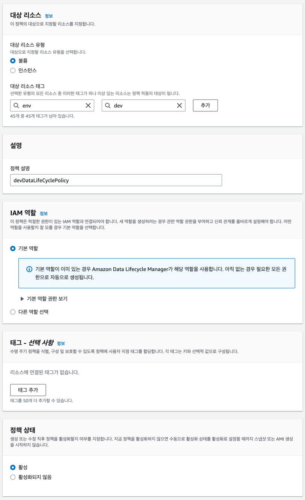
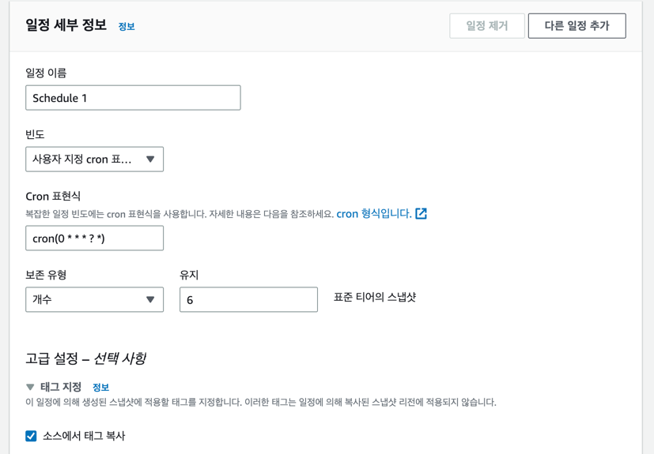
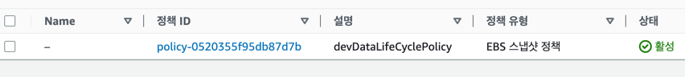

# Continuous cost and sustainability optimization

-  -  -

2023.03.09 ~ 2023.03.

https://catalog.us-east-1.prod.workshops.aws/workshops/42c0fe7e-8d1c-4d5f-8b48-c818c7952242/en-US

이번 워크숍은 연속적 금액과 지속가능성 최적화(Continuous cost and sustainability optimization)에 대해 다룬다. 대규모의 자동화를 통해 CCoE(클라우드 전문가 조직)에서 엔드 유저와 서비스 소유자에게 이러한 역할을 잔달할 수 있도록 하는 워크숍이다.
특히 현실세계에서 사용될 수 있는 예제들을 통해 효율성의 최대화, 금액과 지속가능성 최적화, 에너지 소모를 최소화 하고 탄소 배출을 줄일 수 있는 방안에 대해 학습할 수 있다

- 예상 소모시간 : 120분
- 레벨: 300
- 타겟 유저: CCoE, FinOps, DevOps
- - -
## EBS

### 1. GP2에서 GP3로 마이그레이션 하기

참고자료 https://aws.amazon.com/it/blogs/storage/migrate-your-amazon-ebs-volumes-from-gp2-to-gp3-and-save-up-to-20-on-costs/  
(gp2에서 gp3로 변경하고 20프로 금액 세이브하기)

기존 EBS(Elastic Block Store) gp2의 프로비저닝된 용량에 따라 IOPS가 결정되기 때문에 적은 용량에 높은 성능이 필요한 경우 버스트를 통해 성능을 향상 시킬 수 있지만 버스트 소진 시 성능저하가 일어난다. 
gp2의 다음 버전인 gp3를 사용할 경우 필요한 용량에 상관없이 IOPS와 용량을 프로비전할 수 있기때문에 설계 효율성 측면에서 효과적이다.
금액적인 측면에서도 평균 0.10$/GiB-월인 gp2에 비해 gp3는 0.08$/GiB-월이다. 일반적인 스토리지 사용환경에도, 특수 목적을 위한 볼륨인 경우에도 효율적이며 평균 20%의 금액절감효과를 볼 수 있다.

### 실습

주의! 항상 사용목적에 따라 서비스에 태깅을 하여 환경을 구분하고 꼭 dev 환경에서 검증 후 prod 레벨로 넘어가자.

처음 인스턴스 생성시 스토리지 구성에서 미리 gp3로 적용하면 편하다.

- 콘솔환경 AWS 콘솔 - EC2 - Elastic Block Store - Type = gp2로 검색 (태그도 넣는걸 추천) 
 원하는 볼륨 선택후 우클릭에서 볼륨 수정 클릭, 볼륨 타입 변경 
 
마이그레이션 중 서비스 장애는 발생하지 않으나 혹시 모를 상황을 대비해 미리 알리고 진행할 것  

- 대규모 환경 dev에서 성공적으로 마이그레이션에 성공했다면 파이썬 SDK를 사용해 여러개의 볼륨을 한번에 마이그레이션 해보자. (기존 워크숍의 파이썬 오토메이션 코드가 사라졌기에 추후 추가 예정)

### 결론
dev 환경에서 테스트에 성공했다고 하더라도 대규모로 작업을 진행할때는 서비스 할당량을 고려하여 마이그레이션을 고려해야한다.
항상 양방향작업이기에 gp2가 필요하다면 돌아갈 수 있고 아니면 gp2로 두고 자동화팀을 통해 천천히 전환하는것도 방법이다.
가장 좋은방법은 위의 방법처럼 주요 계정들에게 gp3를 볼륨 생성시 기본 볼륨으로 사용할 수 있도록 구성하는 방법일수도 있다.
작업에 성공했다면 48시간정도의 시간을 두고 (딜레이) Cost Explorer 나 Cost and Usage Report(CUR)를 통해 금액 변화 추이를 확인하자.
작업이 성공적으로 진행됐다면 약 20%정도의 금액 절감 효과를 볼 수 있을 것이며 미리 작성해둔 오토메이션 코드를 통해 필요한 작업들을 수행할 수 있다! 

(CUR 차트로 금액 절감 효과를 확인하는 모습, 출처: AWS Workshop Studio)
 
### 2. 스냅샷 관리
EBS는 볼륨을 카피한 스냅샷을 제공한다. 이 스냅샷을 통해 인스턴스에 문제가 있을 경우 리커버리를 할 수 있다. 그리고 이러한 스냅샷을 지속적으로 관리할 수 있도록 하는 서비스가 DLM(Data LifeCycle Manager)다.
EBS또한 DLM을 제공하며 이를 통해 요구사항에 맞는 스냅샷 관리가 가능하다. 이번 실습에서는 다음과 같은 관리요구가 있다.
- dev 태그가 붙어있는 경우 RPO(recovery point objective, 리커버리 포인트) 1시간과 retention period(보존기간) 6시간을 요구함
- prod 태그가 붙어있는 경우 RPO(recovery point objective, 리커버리 포인트) 1시간과 retention period(보존기간) 하루를 요구함
- 위의 정책으로 생성되지 않은 스냅샷은 매 시간별 정리함

### 실습
dev 환경에 대해서만 실습을 진행해보자.
- 콘솔환경 

Lifecycle Manager(활성)탭에서 새로운 정책 생성 후 다음과 같이 만들어보자, IAM은 기본역할을 해도 AwsDataLifeCycleManagerPolicy와 같은 정책이 넘어오는 것으로 보인다. 기본역할을 사용하자.  

일정이름은 본인이 편한 이름으로, 빈도는 스냅샷을 생성할 빈도인데 요구사항인 1시간을 설정하자. 여러 표현식들이 있지만 실습에서는 cron 표현식을 사용한다. 보존유형은 스냅샷을 얼마나 보존할지에 대한것으로 한시간 단위로 1개가 생성되니 6개까지만 유지하면 6시간 단위로 스냅샷을 유지할 수 있다.  

DLM이 제대로 생성됐는지 확인하고 스냅샷이 생성되는지 확인하자.  

prod환경도 같은 절차도 정책을 생성하여 각 환경에 대한 관리 정책을 확인할 수 있도록 하자.

- unmanaged 스냅샷 파이썬 SDK로 관리
파이썬 SDK를 통해 DLM으로 관리되지 않는 스냅샷을 찾아 삭제할 수 있다.(코드 추후 추가 예정) 이를 SSM에서 커스텀하게 작동시키거나 cron을 통해 1시간 간격으로 실행할 수 있다. 혹은 CloudTrail로 lambda에 트리거를 걸어 스냅샷 생성시에 스크립트를 돌리도록 설정할 수 있다.

  
### 결론
스냅샷은 안정적인 서비스 운영과 복구를 위해 선택할 수 있는 좋은 옵션이지만 스탠다드 스냅샷의 경우 0.05$/GiB-월 의 과금이 있다. 이를 서비스 성격에 맞게 관리하여 불필요한 과금의 요소를 줄일 수 있도록 하자. 또환 DLM외에도 파이썬 SDK와 같이 자동화 할 수 있는 여러 방안을 선택하여 서비스의 성격에 맞는 스냅샷 운영을 할 수 있도록 하자

